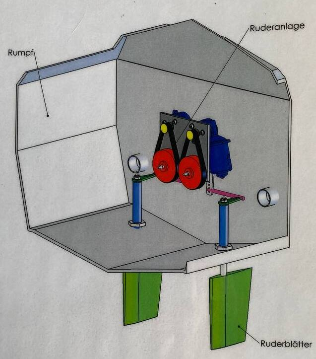

# Rudder Controller – STM32

## Overview
This project is a **closed-loop control system** designed to control rudders using an STM32 microcontroller. It uses a **PID controller** for precise and stable operation and communicates via the **NMEA2000** protocol, making it suitable for marine industry applications.



---

## Features
- **Object-Oriented Design**: Uses a `Motor` class, allowing easy configuration of multiple motors with minimal code in the main file.
- **STM32 Integration**: Leverages STM32 register access for high performance, scalability, and clean code structure.
- **NMEA2000 Protocol**: Supports industry-standard marine communication.
- **Compact PCB**: Custom PCB drastically reduces size, with both power and communication delivered through a single cable.

---

## How It Works

### 1. Input Signal
- A 10-bit setpoint is received via **NMEA2000 CAN bus**.
- `512` represents the **neutral rudder position**.
- Extreme positions can be configured in software to set the desired rudder angles.
  


---

### 2. Feedback Loop
- Rudder position is measured by a **10k potentiometer** read via **10-bit ADC with DMA**.
- The potentiometer value is mapped to the same 0–1023 range as the input signal.
- The error is calculated as the difference between desired and actual positions.

---

### 3. Motor Control

The `Motor` class is responsible for handling rudder control:

```cpp
class Motor {
public:
    Motor(GPIO_TypeDef* port, uint16_t pin,
          volatile uint32_t* ccr,
          uint16_t* potValue, uint16_t potMax, uint16_t potMin,
          uint16_t* setPoint,
          double Kp, double Ki, double Kd);

    void controlLoop();   // Runs PID and updates CCR
    void setDirection();  // Sets motor direction based on PID output

private:
    GPIO_TypeDef* _myPort;
    uint16_t _myPin;

    uint16_t* _mypotValue;
    uint16_t _mypotMax;
    uint16_t _mypotMin;

    double _myoutput;                      // Output to CCR
    uint16_t* _mysetPoint_CAN_Rx;          // Setpoint from CAN bus

    volatile uint32_t* _ccr;               // Pointer to CCRx register

    PID pid;                               // PID controller instance
};
```
# Rudder Controller – STM32

## Overview
This project is a **closed-loop control system** designed to control rudders using an STM32 microcontroller. It uses a **PID controller** for precise and stable operation and communicates via the **NMEA2000** protocol, making it suitable for marine industry applications.

---

## Features
- **Object-Oriented Design**: Uses a `Motor` class, allowing easy configuration of multiple motors with minimal code in the main file.
- **STM32 Integration**: Leverages STM32 register access for high performance, scalability, and clean code structure.
- **NMEA2000 Protocol**: Supports industry-standard marine communication.
- **Compact PCB**: Custom PCB drastically reduces size, with both power and communication delivered through a single cable.

---

## How It Works

### 1. Input Signal
- A 10-bit setpoint is received via **NMEA2000 CAN bus**.
- `512` represents the **neutral rudder position**.
- Extreme positions can be configured in software to set the desired rudder angles.


---

### 2. Feedback Loop
- Rudder position is measured by a **10k potentiometer** read via **10-bit ADC with DMA**.
- The potentiometer value is mapped to the same 0–1023 range as the input signal.
- The error is calculated as the difference between desired and actual positions.

---

### 3. Motor Control

The `Motor` class is responsible for handling rudder control:

```cpp
class Motor {
public:
    Motor(GPIO_TypeDef* port, uint16_t pin,
          volatile uint32_t* ccr,
          uint16_t* potValue, uint16_t potMax, uint16_t potMin,
          uint16_t* setPoint,
          double Kp, double Ki, double Kd);

    void controlLoop();   // Runs PID and updates CCR
    void setDirection();  // Sets motor direction based on PID output

private:
    GPIO_TypeDef* _myPort;
    uint16_t _myPin;

    uint16_t* _mypotValue;
    uint16_t _mypotMax;
    uint16_t _mypotMin;

    double _myoutput;                      // Output to CCR
    uint16_t* _mysetPoint_CAN_Rx;          // Setpoint from CAN bus

    volatile uint32_t* _ccr;               // Pointer to CCRx register

    PID pid;                               // PID controller instance
};
```
- PID values can be changed during runtime via bash over CAN (NMEA2000), without updating the firmware.

---

### 5. Working Principle

```cpp
void Motor::setDirection() {
    HAL_GPIO_WritePin(_myPort, _myPin, (_myoutput > 0) ? GPIO_PIN_SET : GPIO_PIN_RESET);
}

void Motor::controlLoop() {
    setDirection();
    pid.compute();
    if ((_myoutput > 0 && *_mypotValue < _mypotMax) ||
        (_myoutput < 0 && *_mypotValue > _mypotMin)) {
        *_ccr = static_cast<uint32_t>((_myoutput < 0) ? -_myoutput : _myoutput);
    } else {
        *_ccr = 0;
    }
}
```
- **`setDirection()`**: Controls the motor's rotation direction.
- **`controlLoop()`**: Updates the PWM duty cycle based on PID output and ensures the shaft stays within defined bounds.

---

### Components

- **Microcontroller**: STM32F302RB – Reads input signals, processes feedback, and controls PWM output.
- **Custom PCB**: Contains STM32 MCU, switching regulator, connectors, and CAN transceiver.
- **Motor Driver**: MDDS10 – Dual-channel motor driver for controlling direction and speed.
- **Encoder**: 10k potentiometer – Measures rudder shaft position for feedback.

---

### PCB Design

The custom PCB was developed with several key advantages:

- **Size Reduction**: Final module is over 50% smaller, helping to reduce enclosure costs.
- **Tighter Integration**: Power regulation and CAN transceiver are integrated directly onto the board.
- **Cost Efficiency**: Approximate cost is **€25 per board**.
  - Cheaper than Arduino R4 (€31).
  - Slightly more than STM32 Nucleo, but includes **native NMEA2000 support** which Nucleo lacks.

**Conclusion**: The custom PCB offers a more functional and cost-effective solution for real-world production systems.

<p float="left">
  
  
</p>

<p align="center"><b>STM32 Custom Board - Front and Back</b></p>

<p float="left">
  
  
</p>

<p align="center"><b>Comparison: Custom PCB vs Arduino-based System</b></p>

---

### Example Initialization

```cpp
Motor motor_left(GPIOA, GPIO_PIN_4,     // Direction pin
                 &(TIM2->CCR1),         // PWM output (CCR register)
                 &adc_value[0],         // ADC DMA input
                 740, 240,              // Potentiometer max/min
                 &CanMessage[0],        // Setpoint from CAN
                 5.0, 0.0, 0.0);        // PID values

while (1) {
    // motor_left.controlLoop();
    // motor_right.controlLoop();
}
